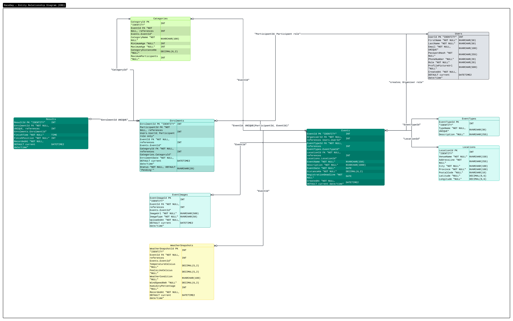
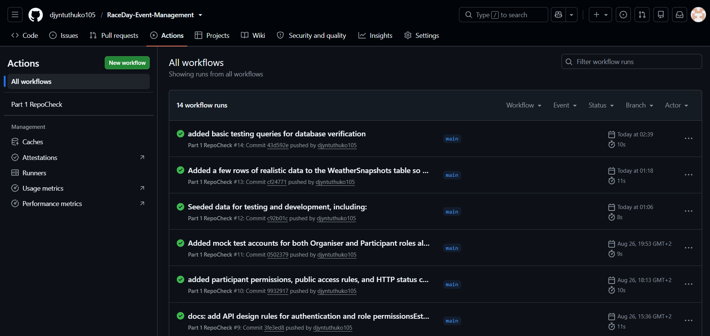

# RaceDay

RaceDay is a web-based event management system designed for the South African road running, walking and cycling community.

The system allows Event Organisers to manage sporting events, categories, participant enrolments and results. Participants can browse events, select categories, enrol for events and track their results.

---

## System Roles

### Organiser

Organisers can:

- Create events
- Edit events
- Delete events
- Manage event categories
- View participant enrolments
- Capture participant results

### Participant

Participants can:

- Create an account
- Browse available events
- View event information
- Select an event category
- Enrol for events
- View their enrolments
- View their race results

---


## Repository Structure

```text
RaceDay-Event-Management/
│
├── .github/
│   └── workflows/
│       └── part1-repocheck.yml
│
├── docs/
│   ├── api_endpoint_plan.md
│   ├── erd.png
│   └── RaceDayDatabase.sql
│
├── CI.png
└── README.md
```

---


## Part 1 - System Planning and Database

Part 1 contains the planning and database components for the RaceDay system.

The following deliverables have been completed:

- Entity Relationship Diagram (ERD)
- REST API Endpoint Plan
- SQL Database Script
- GitHub repository setup
- GitHub Actions validation workflow

---


## Entity Relationship Diagram

The RaceDay database contains the following entities:

- Users
- EventTypes
- Locations
- Events
- Categories
- Enrolments
- Results
- EventImages
- WeatherSnapshots

The ERD includes the entity attributes, primary keys, foreign keys and relationships between the entities.


**Below is the RaceDay ERD:**




---


## API Endpoint Plan

The API Endpoint Plan defines the REST API for the RaceDay system.

The plan includes:

- HTTP Method
- Route
- Description
- Role Required
- Request Body
- Expected Response

The endpoint plan covers the main system functionality, including authentication, user profiles, events, categories, enrolments and results.

The completed API Endpoint Plan is available at:

```text
docs/api_endpoint_plan.md
```

---


## SQL Database

The RaceDay database was created using Microsoft SQL Server.

The SQL script contains:

- Database creation
- Table creation
- Primary keys
- Foreign keys
- NOT NULL constraints
- UNIQUE constraints
- DEFAULT constraints
- CHECK constraints
- Sample data

The database contains the following tables:


| Table            | Purpose                                        |
| ---------------- | ---------------------------------------------- |
| Users            | Stores Organiser and Participant information   |
| EventTypes       | Stores event types such as Run, Walk and Cycle |
| Locations        | Stores event location information              |
| Events           | Stores RaceDay event information               |
| Categories       | Stores categories for each event               |
| Enrolments       | Links Participants to events and categories    |
| Results          | Stores participant finish times and positions  |
| EventImages      | Stores event image information                 |
| WeatherSnapshots | Stores weather information related to events   |


The database includes sample data for:

- 2 Organisers
- 2 Participants
- 3 Events
- Categories for each event
- Sample enrolments
- Sample results
- Event images
- Weather information

The completed SQL script is available at:

```text
docs/RaceDayDatabase.sql
```

---


## Running the Database

The database script can be executed using Microsoft SQL Server Management Studio (SSMS).

### Requirements

- Microsoft SQL Server
- SQL Server Management Studio (SSMS)


### Steps

1. Open SQL Server Management Studio.
2. Connect to a SQL Server instance.
3. Open:
  ```text
   docs/RaceDayDatabase.sql
  ```
4. Execute the complete script.
5. The `RaceDayDB` database will be created.
6. The tables and sample data will be inserted.

The completed database can be viewed under:

```text
Databases
└── RaceDayDB
```

---


## GitHub and Version Control

GitHub is used to manage the RaceDay project and track development progress.

The repository contains more than 20 meaningful commits covering areas such as:

- ERD development
- Database development
- API endpoint planning
- Database relationships
- Constraints
- Sample data
- Repository configuration
- GitHub Actions

---


## GitHub Actions

GitHub Actions is used to validate the Part 1 repository structure.

The workflow checks that the required documentation files are present:

```text
docs/
├── api_endpoint_plan.md
├── erd.png
└── RaceDayDatabase.sql
```

The workflow is located at:

```text
.github/workflows/part1-repocheck.yml
```

The workflow completed successfully and produced a green build.

### CI/CD Build



---


## Project Status


| Part 1 Component        | Status   |
| ----------------------- | -------- |
| ERD                     | Complete |
| API Endpoint Plan       | Complete |
| SQL Database Script     | Complete |
| Repository Structure    | Complete |
| GitHub Actions Workflow | Complete |
| CI/CD Validation        | Complete |


---


## Conclusion

RaceDay Part 1 has been completed with the required system planning, database design and repository setup.

The ERD, API Endpoint Plan and SQL Database Script provide the foundation for the RaceDay system and are stored together in the `docs` folder.

GitHub is used for version control, while GitHub Actions provides automated validation of the required Part 1 repository structure.